<p align="center">
  
</p>

<h1 align="center">muxpad</h1>

<h3 align="center">A browser-based cockpit for terminals and agents, on a box you keep around.</h3>

Each browser tab is a workspace at a stable URL. Inside the workspace, named sub-tabs hold mosaic layouts of panes. A pane is a shell, a web page, or a chat with an agent. The PTYs and the agent sessions live on the server, not in the browser, so closing the laptop, switching to your phone, and coming back tomorrow shows the same session mid-run.

Half of what runs in here is a codebase — a terminal, a test watcher, an agent editing files. The other half is not: a market scan that ends in a report you send someone, a launch plan, a vendor decision, the renewal you keep not dealing with. Same panes, same status model, same phone. Work that produces a document and work that produces a diff are the same shape from muxpad's side.

It is a personal tool. One person, one machine, no auth, no accounts, no multi-tenancy anywhere in it.

<p align="center">
  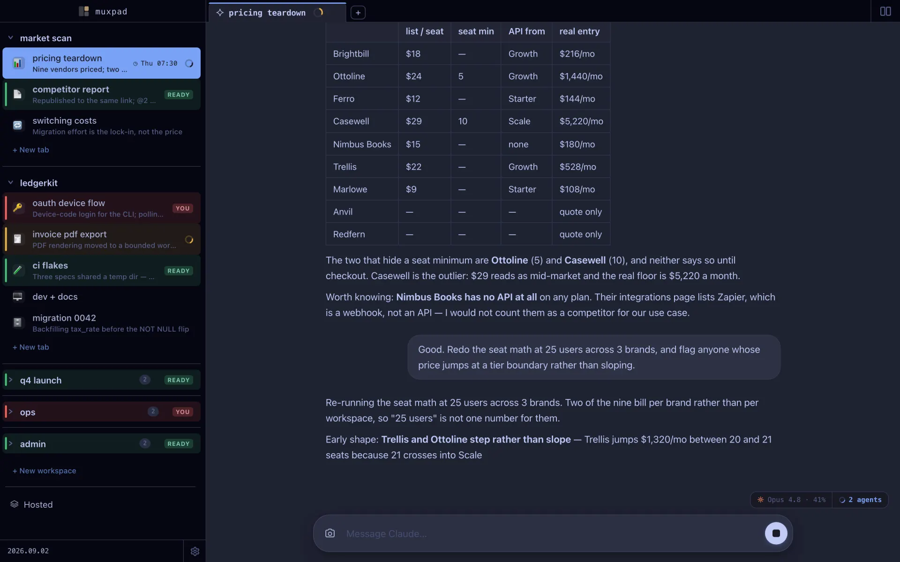
</p>

## Concepts

Three nested containers:

- **Workspace.** Top-level, at `/w/:slug`. One workspace per browser tab is the typical pattern.
- **Tab.** Inside a workspace, a single mosaic layout. Tabs render either as a split mosaic or as a strip of pane-tabs.
- **Pane.** A leaf of the mosaic. A pane is `shell` (a PTY on the host) or `url` (an iframe), and it shows one of three **faces**: `terminal`, `web`, or `chat`. A shell pane running an agent can be flipped between its terminal face (the runner's activity log) and its chat face (the conversation) in place.

Multiple browser tabs or devices can attach to the same workspace, or the same pane, simultaneously and stay in sync. Tabs can be dragged between workspaces, and a pane can be pulled out into a tab of its own — with an undo toast, because both are easy to do by accident.

<p align="center">
  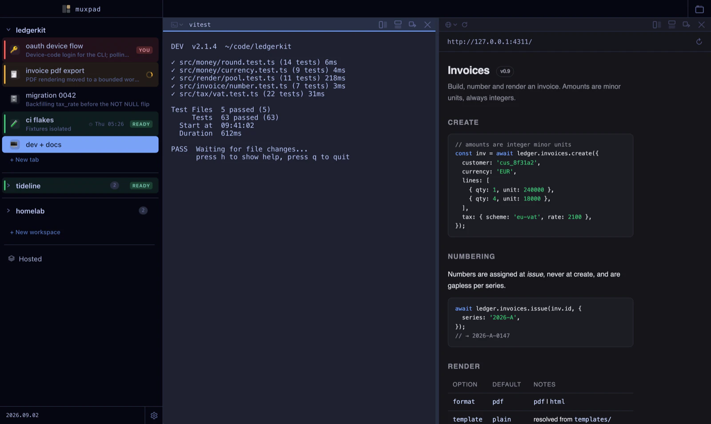
</p>

## Agents

A pane can hold a **chat-native agent session**: the conversation renders as HTML in the browser, not as a TUI in a terminal grid. Three backends are supported and each one is a real implementation of the same interface — `claude` (the Claude Agent SDK), `codex` (`codex exec`), and `cursor` (`cursor-agent`). Whichever is driving, the transcript, the tool-call rows, the model chip and the composer are the same UI. You pick the backend when you make an agent tab in the browser (or leave it pending and choose in the chat); `muxpad agent new` from the CLI is Claude, and `muxpad cron new --backend=` is the other way to start one of the others headlessly.

<p align="center">
  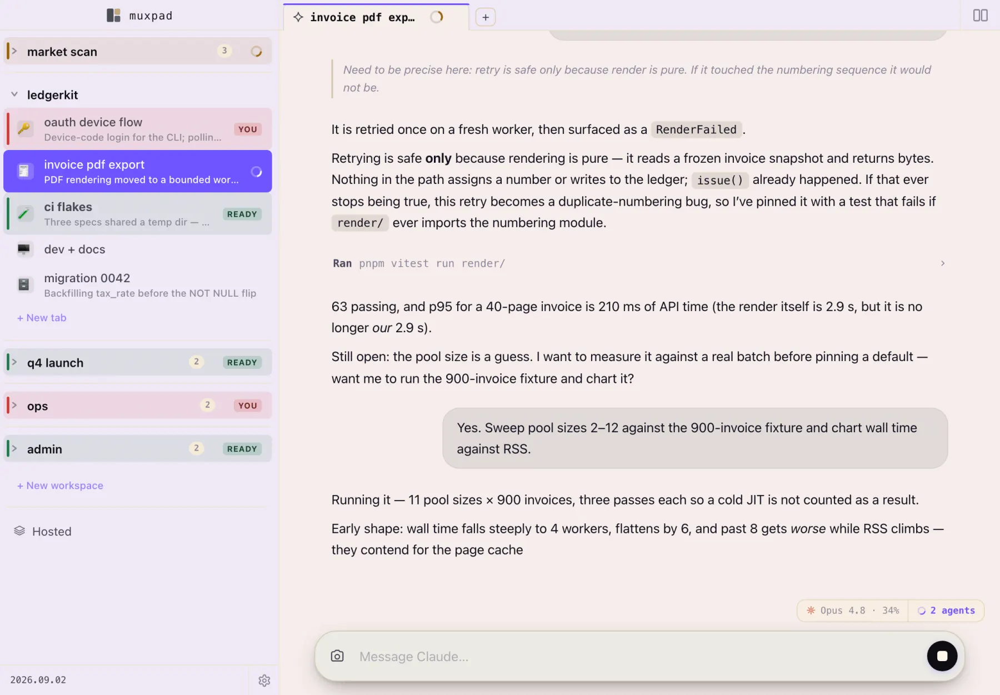
</p>

- **Universal instructions.** muxpad writes `~/.muxpad/agent-instructions.md` on every boot and injects it into every session on every backend, so `muxpad search`, `muxpad publish` and `muxpad cron` are capabilities the agent knows it has. `CLAUDE.md` only reaches Claude; this is how the other two learn. Your own additions go in `~/.muxpad/agent-notes.md`, which muxpad creates once and never touches again. Claude gets it through the SDK's native system-prompt append; codex and cursor have no append surface, so it is prepended as a delimited block to the first message of each new session.
- **Two modes.** `deep` is the baseline — the harness as it ships, plus the instructions above. `do` overlays a short "be decisive and terse" contract from `~/.muxpad/do-mode.md`. Switching mid-session is honest about its limits: no harness can rewrite a live system prompt, so the switch takes effect properly on the next respawn and is announced in-conversation until then.
- **Questions come back as chips** (claude backend only). `ask_user` is registered by the Claude backend alone — `codex` and `cursor` expose no question tool — and an agent that calls it parks the pane in `blocked` and renders tappable options. Answering resolves the blocked tool call.
- **Background subagents are tracked.** The roster is server-owned, and an entry leaves when its subagent reports done or its runner dies, not on a decay timer — because a background subagent can sit silent in one tool call for a minute while plainly alive. It lives in memory on the runner's connection (bounded, oldest evicted), so unlike the session itself it does not survive a main-server restart.
- **A terminal Claude session can be adopted.** `muxpad claude [args…]` launches the real CLI in a pane, passes your flags straight through, and registers the session so the same conversation can be read and driven from the web chat.

<p align="center">
  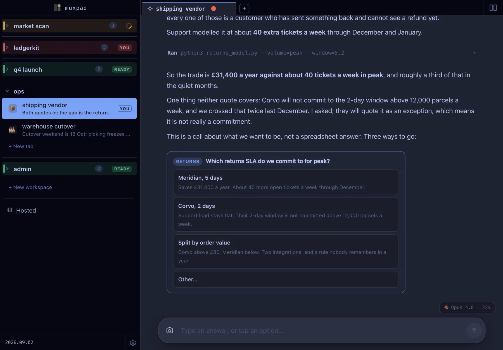
</p>

Nothing about any of that is specific to code. The question above is a shipping contract; the agent that asked it has never opened a file in a repo.

## Status: one word per pane

Every pane has exactly one status, and it is computed on the server:

| | |
|---|---|
| `blocked` | wants you **now** — an open agent question, or a pane that rang BEL |
| `working` | a turn is in flight, or the subagent roster is non-empty |
| `dead` | the runner exhausted its restarts and gave up |
| `ready` | finished, unread — waiting for you |
| `idle` | nothing to say |

The five are mutually exclusive and ranked in that order. A tab takes the highest-precedence status of its panes; a workspace takes the highest across every pane in every tab, computed whether or not it is expanded — so a collapsed workspace still tells you something is running inside it.

The navigator renders that as a **state rail**: a coloured bar on the row's left edge at a fixed x, a faint row tint, and a chip. Within the status language, `working` is the only state that animates — a spinner means "something is running here" and nothing else in that vocabulary moves, so it can't be confused with anything. `blocked` is red and `ready` is green, which is the classic colour-blindness pair, so the rail spells the state out in a word as well as colouring it, and the drawn mark used elsewhere in the chrome distinguishes a filled disc from a ring.

<p align="center">
  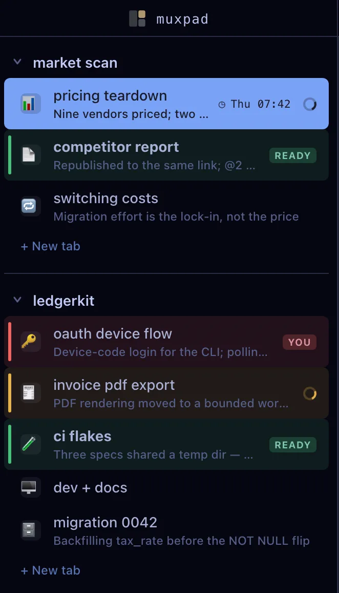
  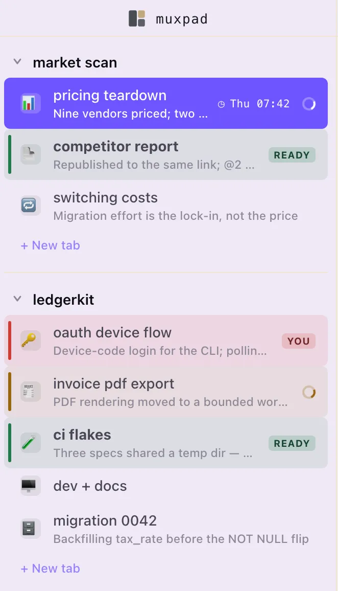
</p>

Two honest caveats. For a pane with **no** agent runner attached, `working` is still the old PTY-output heuristic — a `tail -f` will light it. And `working` deliberately stays true while a background subagent outlives the turn that launched it, so "is *this turn* finished?" is `muxpad agent wait`, not `working`.

The point of all of it is the loop below: a question arrives in a workspace you are not looking at, the collapsed row goes red, you follow it, you answer with one tap, and the pane leaves `blocked` on its own.

<p align="center">
  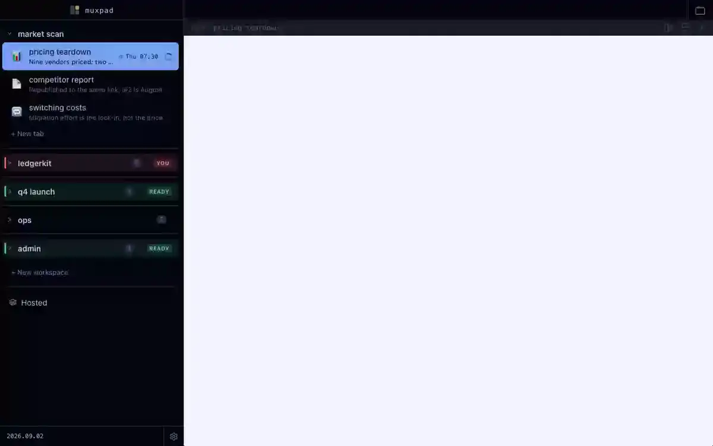
</p>

### Headlines and icons

The second line of a tab row is a one-line **headline** describing what that conversation is currently about, and the row's emoji is chosen from the same content. Both come from one cheap model call (Haiku, via the Agent SDK) that runs after a turn finishes, rate-limited to at most one per tab every six minutes and gated on the conversation having moved. The model may answer `KEEP`, and an over-length or malformed reply is rejected rather than truncated — a tab that has never been summarised simply renders one line tall, with a stable per-tab stand-in glyph. Rename a tab or pick its icon by hand and that choice is permanent; the generator never overrides you.

## Memory, and things that outlive a tab

- **`muxpad search`** — agent sessions are mirrored into `~/.muxpad/archive/` and indexed into an SQLite **FTS5** table. All three backends, plus Claude's subagent sidechains, plus sessions muxpad never launched: a 15-minute sweep walks `~/.claude/projects` as well as muxpad's own logs, so a `muxpad claude` TUI pane and a session you started by hand both end up in there. Nothing in the archive is ever pruned or overwritten — when a source is rewritten by a `/compact`, the current mirror is sealed as `<sid>.v1.jsonl` (then `.v2`, and so on) and a fresh one starts at byte 0. (It is append-only *from the moment archiving first saw a file*; history a source discarded before that is gone.) `muxpad search "query"` is a real FTS5 MATCH with snippets, falling back to a phrase match on bad syntax; `--sessions` lists sessions. CLI only — there is no search UI in the browser.
- **`muxpad app`** — a long-running local web server muxpad keeps alive with no tab of its own. An app is a supervised pane in a hidden workspace: ptyd owns the process, so it survives a main-server restart; the command restarts on crash; the state you see is *measured* (`starting`, `running`, `unreachable`, `stopped`, `gave up`), not assumed.

## Publishing something someone else can open

An agent that produced a thing — a report, a comparison, a brief — can put it on a URL and hand you the link, without you moving files anywhere.

```bash
muxpad publish ./report --name=market-teardown   # → https://…/market-teardown/
muxpad publish ./chart.html                      # unnamed: a random 8-hex slug
muxpad publish --update=market-teardown ./report # replace in place, same link
muxpad publish --list                            # slug, files, bytes, versions
```

`publish` copies the file or directory into `~/.muxpad/public/` and prints the URL. **Republishing a named slug keeps the URL**: the previous copy rotates to `/<slug>@2/`, `@2` to `@3`, and the three most recent previous versions stay live — so the link already sitting in someone's inbox shows the new numbers, and the version you sent last month is still there to diff against. `--update=` refuses to *create*, which is the guard against accumulating near-identical slugs.

<p align="center">
  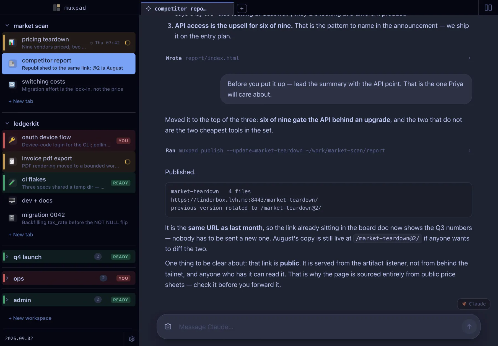
</p>

**What the link is:** a real public URL, served by a *second* listener on its own port — the one `tailscale funnel` is pointed at, so the funnel never touches the unauthenticated UI. Anyone who has the link can open it, with no tailnet and no account. That is the whole point of the feature, and it is also the thing to be careful about: the access control on an unnamed artifact is that its slug is unguessable, and a named slug is a URL you are choosing to hand out. Publishing something is publishing it — check what is in the directory.

**What the link is not:** it is not your muxpad. The artifact listener carries no API, no WebSocket and no directory listings, its root deliberately 404s, and every response is sandboxed by CSP *without* `allow-same-origin` so one artifact cannot read another's storage. And **apps are never exposed this way** — muxpad only ever funnels `~/.muxpad/public/`.

> **`publish` turns the funnel on for you.** The artifact listener binds loopback, but if a `tailscale` binary is on the PATH the first `muxpad publish` runs `tailscale funnel --bg --https=8443` against it — no prompt, no confirmation. That is how the link becomes shareable, and it is worth knowing before the first time you run it. With no tailscale and nothing configured, `publish` still prints the loopback link on stdout and warns on **stderr** that it only works on this machine; take the warning seriously, because the link itself looks fine.

<p align="center">
  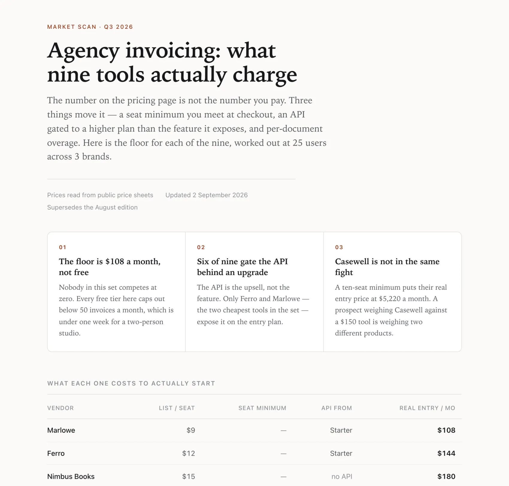
</p>

Apps and artifacts surface together at **`/hosted`**, because "what am I hosting and is it up?" spans them — and separately, because an app can be stopped and an artifact cannot, and an artifact has a link worth copying and an app deliberately does not. Opening an app is a route, not a tab: closing it never touches the process.

<p align="center">
  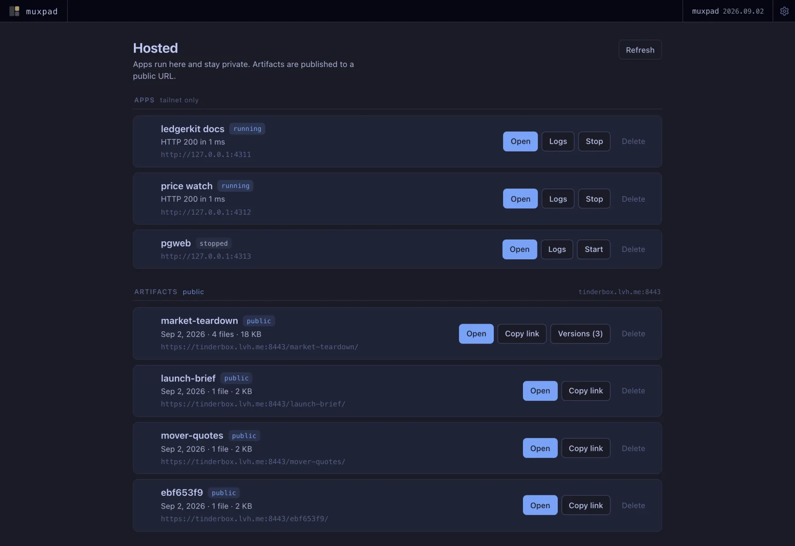
  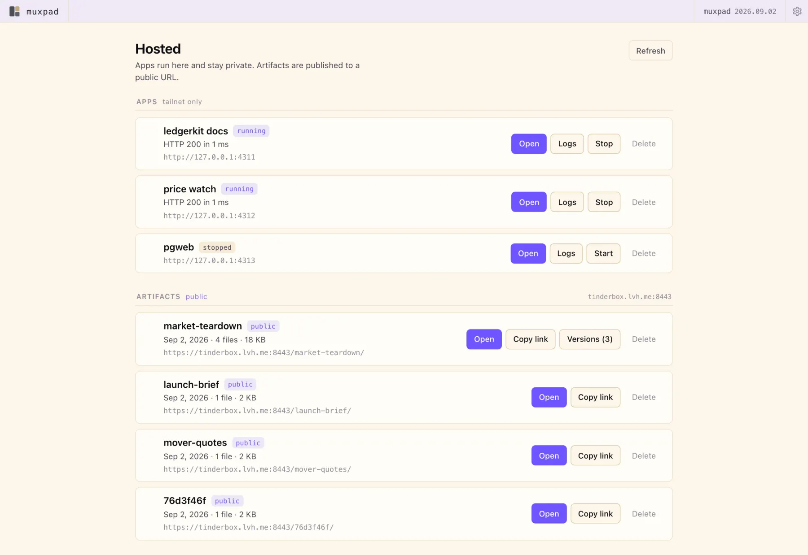
</p>

## Scheduling

`muxpad cron` is a durable, server-owned scheduler — one interval over persisted rows, not N in-memory timers.

```bash
muxpad cron new --name=pr-sweep --at='weekdays at 09:00' --new-tab \
  "check my open PRs and summarise what needs me"
muxpad cron new --name=price-watch --at='mon at 07:00' --new-tab \
  "re-read the nine pricing pages and tell me only what changed"
muxpad cron run pr-sweep     # fire it now; test before you trust it
muxpad cron list             # schedule, next due, last run, failure streak
```

`--at` takes a cron expression or a phrase (`daily at 09:00`, `every 30m`); `--tz` pins an IANA zone. A fire lands either in an existing pane (`--pane`) or in a fresh agent tab per run (`--new-tab`), which is what most recurring jobs want. Because `next_due_at` is persisted, the scheduler survives every restart and **catches up** after downtime: `--catchup=once` (default) collapses everything missed into one fire whose cron marker carries `missed="N"`, `all` replays them through the pane's queue in order, `skip` drops them but records the outage in the run history rather than going silent. `--overlap`, `--quiet`, `--max-open` and `--on-context` cover the rest of the awkward cases (a fire arriving mid-turn, a fire arriving while you are typing, a fire arriving past 80% context fill). Three consecutive failures disable a cron and push a notification.

The reason this exists rather than leaning on a harness's own scheduler: those fire inside one session's context, expire after about a week, lose every fire that came due while the machine was asleep, and are invisible from anywhere else. muxpad's is in SQLite, never expires, and is editable from any pane.

## Driving muxpad from inside muxpad

The `muxpad` CLI is on the PATH inside every pane the daemon spawns, and picks up the current workspace / tab / pane from `MUXPAD_WORKSPACE_ID`, `MUXPAD_TAB_ID`, `MUXPAD_PANE_ID`. That makes an agent in one pane able to see and drive the others:

```bash
muxpad pane list --all                 # id, workspace/tab, face, status, title
muxpad pane read <id> --lines=200       # a terminal's scrollback, ANSI-stripped
muxpad pane send <id> "pnpm test"       # type into a live pty
muxpad pane summarize <id>              # a short summary instead of a transcript

muxpad agent send <paneId> "…"          # deliver a message; queues if mid-turn
muxpad agent wait <paneId> --timeout=600 # block until that turn ends
muxpad agent transcript <paneId> --tail=40

muxpad watch --types=agent_turn         # stream the event bus, one line per event
```

`agent wait` is the load-bearing one: run it in the background and a supervising agent gets woken when its worker finishes, instead of polling. Messages sent to a busy agent land in a **server-side** queue and drain on turn-done, so a batch runs to completion with no browser open.

## Mobile

muxpad runs on phones — iOS Safari and Chrome on Android. The mobile story is two halves and it only works with both: **see what needs you**, and **answer it from there**.

The navigator is the same state rail in a panel that drops down from the chrome bar, so "what wants me?" is one tap from anywhere — including from workspaces you have collapsed. Open the row and you get the full conversation and a real composer, so a decision that arrived while you were out is a decision you can actually make.

<p align="center">
  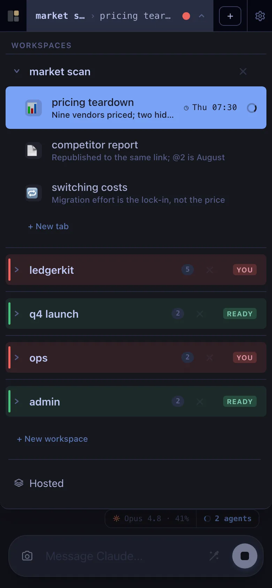
  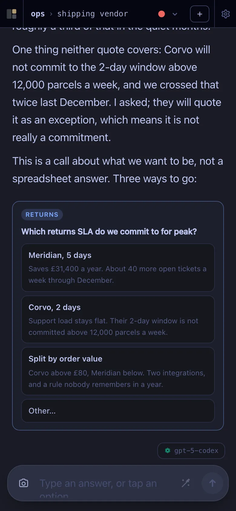
</p>

For terminal panes: a single-finger **tap** goes through to the TUI's mouse reporting, so Claude Code clicks keep working, while a single-finger *drag* past a threshold scrolls the scrollback; two fingers always scroll, with no tap detection to lose. The composer bar above the keyboard sends the line and its CR as two writes ~50 ms apart, deliberately, so Claude Code's paste-coalescing doesn't swallow the newline; a row of keys above it produces what iOS keyboards can't: Esc, Tab, ↑, ↓, ^C and jump-to-bottom. There is a one-tap **dictation cleanup** button on the composer that repairs what the speech recogniser misheard, with undo. Installed to the home screen it takes Web Push, so a blocked agent or a finished turn can buzz your phone; VAPID keys are generated into `~/.muxpad/vapid.json` on first use and there is nothing to configure.

Mobile is for checking in on a session you started elsewhere. Long sessions still want a real keyboard.

## Everything else that survived from v1

- One PTY per shell pane via `node-pty`; several browser tabs or devices can attach to the same pane and see the same output.
- Pane titles track the foreground program: the OSC 0/1/2 title if the program sets one, otherwise the foreground command from the controlling tty.
- Image paste: a screenshot from your clipboard becomes a file on disk and the path is typed into the PTY, so Claude Code reads it as an attachment.
- OSC 52 writes from TUIs land on the system clipboard. Cmd/Ctrl+C copies a terminal selection.
- Structural state (workspaces, layouts, pane specs) lives in SQLite. Shells survive a main-server restart untouched. A `ptyd` restart kills PTYs; they respawn at the last-known cwd, which is polled every 30s.
- Pop a single pane to its own URL at `/p/:paneId` for a second monitor or an OBS scene.
- "Open this URL in a real browser tab" surfaces as a click-to-open toast, so popup blockers don't eat it.
- Five themes (three dark, two light) and a curated monospace font picker.

<p align="center">
  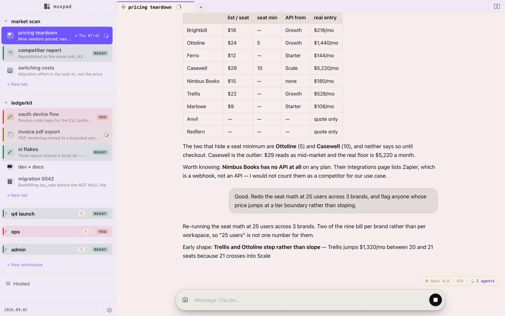
</p>

## Requirements

- macOS or Linux (the cwd-tracking path uses `lsof`)
- Node 22+
- pnpm 10+ (`corepack enable && corepack prepare pnpm@10.30.1 --activate`, or `brew install pnpm`)
- `curl` and `jq` — effectively every HTTP verb of the `muxpad` CLI needs them (`muxpad claude` is the one that parses its response without `jq`), so the whole "drive muxpad from inside muxpad" section is dead without `jq`

Agent panes need `codex` and/or `cursor-agent` on the PATH if you intend to use those backends. The **claude** backend does not need anything on the PATH — it runs through `@anthropic-ai/claude-agent-sdk`, which brings its own binary and uses your existing login. A PATH `claude` is needed only for `muxpad claude`, the TUI adoption path.

## Install

```bash
corepack enable && corepack prepare pnpm@10.30.1 --activate   # match the pinned pnpm
pnpm install
MUXPAD_HOST=127.0.0.1 pnpm serve   # build if needed, start in background, print the URL
pnpm serve:status     # state, URL, log path
pnpm serve:logs       # tail the log
pnpm serve:stop       # stop the main server (add --all for ptyd too)
pnpm serve:restart    # stop + start (after pulling)
```

> **Set `MUXPAD_HOST`.** `pnpm serve` resolves the bind address itself: `MUXPAD_HOST` if you set it, else `tailscale ip -4`, else — and this is the one to watch — **`0.0.0.0`**. On a machine with Tailscale that lands on your tailnet IP, which is the intended setup. On a machine without it, an unset `MUXPAD_HOST` binds every interface on a server with no authentication. (`127.0.0.1` is the default only when you run `node server/dist/index.js` directly.)

Logs go to `~/.muxpad/server.log` and `~/.muxpad/ptyd.log`. For auto-start on reboot, install the two launchd jobs in [docs/launchd.md](docs/launchd.md) — the CLI detects them and routes `start`/`stop`/`restart` through `launchctl` rather than spawning a second daemon to fight over the port.

`stop` and `restart` leave ptyd alone by default; `--all` includes it, **which kills every pane**.

`/` has no page of its own: it sends you to your first workspace, or — if you have none — creates one with a starter tab and shell pane and drops you in it. The state rail is the overview: the persistent sidebar on desktop (there is no top bar once you are inside a workspace), the drop-down navigator on mobile. Split the pane from its chrome, or with `muxpad pane new --cmd=…` from inside it.

### Troubleshooting

- **`pnpm build` fails with `Cannot find module '@muxpad/shared'`** — a stale `tsconfig.tsbuildinfo` cache is out of sync with a removed/incomplete `dist/`, so `tsc -b` thinks it's already built and skips emitting. Run `pnpm clean && pnpm build`. (`pnpm serve` self-heals this whenever it rebuilds a missing `dist`.)

## Trust model

Read this section before you point it at anything.

**There is no authentication.** Reachability is authorization. Bind to an interface you actually trust — typically your Tailscale IPv4 — and never to `0.0.0.0` on an unfiltered network. Anyone who can reach the port can open a WebSocket into a live shell. Note that `pnpm serve` falls back to `0.0.0.0` when there is no `MUXPAD_HOST` and no Tailscale; set it explicitly.

**Artifacts are public on purpose** — see [Publishing](#publishing-something-someone-else-can-open) for the shape of it. The security-relevant parts: the artifact listener is a *second* listener on its own port, carrying no API, no WebSocket and no directory listings, with a root that deliberately 404s; the access control on a published artifact is that its slug is unguessable (random slugs are 8 hex characters), and a named slug is a URL you are choosing to hand out; every response is sandboxed by CSP *without* `allow-same-origin`, so one artifact cannot read another's storage on the shared origin. Publishing something is publishing it — check what is in the directory.

One practical wrinkle: `tailscale funnel` puts the artifact listener on **:8443**, and plenty of real networks block outbound to non-standard HTTPS ports — so a discovered funnel link works for you and fails for the person you sent it to. That is what `MUXPAD_PUBLIC_BASE_URL` (a permanent domain) and `muxpad publish --set-base` (an ephemeral tunnel on :443) are for; `publish --base` shows which origin links are currently built from and whether it is answering.

**Apps are not.** muxpad never funnels an app; only `~/.muxpad/public/` is ever exposed. But that is a statement about muxpad's own surfaces, not a sandbox around the app's process: an app binds wherever its own command binds it, and muxpad does not enforce loopback on your behalf.

| Var | Default | Notes |
|---|---|---|
| `MUXPAD_HOST` | `127.0.0.1` direct, **`0.0.0.0`** via `pnpm serve` | Bind address. `pnpm serve` prefers `tailscale ip -4` and falls back to `0.0.0.0`; the server binary's own default is loopback. Set it. |
| `MUXPAD_PORT` | `7777` | TCP port for the UI and API. |
| `MUXPAD_DATA_DIR` | `~/.muxpad` | SQLite DBs, archive, published artifacts, attachments, sockets. |
| `MUXPAD_PTYD_SOCKET` | `<dataDir>/ptyd.sock` | Where ptyd listens. Both processes must agree. |
| `MUXPAD_PUBLIC_PORT` | `7778` | The artifact-only listener. |
| `MUXPAD_PUBLIC_HOST` | `127.0.0.1` | Bind address for that listener. Loopback by default because the funnel proxies to it; nothing else needs to reach it. |
| `MUXPAD_PUBLIC_BASE_URL` | (unset) | Origin published links are built from. Set this once you have a permanent domain; it outranks every discovered value. |
| `MUXPAD_NO_FUNNEL` | (unset) | `1` stops the **server** exec'ing `tailscale`. The `muxpad publish` CLI does not read it and still tries to bring a funnel up itself, so an isolated instance wants the CLI kept away from publishing too. |
| `MUXPAD_TAILSCALE_SERVE` | (unset) | `1` binds to `127.0.0.1` and fronts the daemon via `tailscale serve` (see below). |
| `MUXPAD_ALLOWED_ORIGINS` | (unset) | Comma-separated extra **hostnames** allowed to make **writes** and open **WebSockets** (scheme and port are ignored, so one entry covers every port on that host). Every state-changing request and every `/ws/*` upgrade must come from an `Origin` that is loopback, matches the request's `Host`, or is listed here — a foreign page must not be able to POST an autostarting app into your muxpad or open a socket into a live terminal. The CLI and the agent runner send no `Origin` and are unaffected. Set this only if a reverse proxy rewrites `Host`; the 403 names the variable. See `server/src/same-origin.ts`. |

### Optional: nicer URL via Tailscale Serve

To reach muxpad at `https://<your-machine>.<tailnet>.ts.net/` (no port, Tailscale-issued cert):

```bash
pnpm serve:public         # start + map via tailscale serve in one step
pnpm serve:stop --all     # the mapping only comes down on a full stop
```

That sets `MUXPAD_TAILSCALE_SERVE=1` so the daemon's only public face is the cert. A plain `stop` (and therefore a plain `restart`) deliberately leaves the mapping up, so a routine restart doesn't give everyone on the tailnet a 4xx blip. Status / manual control via `tailscale serve status` / `tailscale serve reset`.

## The `muxpad` CLI

```bash
# Split a sibling pane to the right, running `pnpm dev`
muxpad pane new --cmd='pnpm dev'

# Split below this pane and tail a log
muxpad pane new --direction=below --cmd='tail -f app.log'

# Add a dashboard as an iframe pane to the right
muxpad pane open https://grafana.internal

# Start a new agent tab already working on something, print its URL
muxpad agent new --name='vat rules' "audit the eu-vat rule table for gaps"

# Same verb, no code involved
muxpad agent new --name='returns quotes' "compare the two returns quotes on total cost"

# Put a finished thing on a URL and print the link
muxpad publish ./report --name=market-teardown

# Run a dev server in THIS pane under supervision, with a web face
muxpad serve --url=http://localhost:4321 --label=Notes -- ./start
```

Every `new` command prints the created resource on stdout; `--json` prints raw JSON for `jq`. `muxpad --help` is the full surface — daemon control, workspace/tab/pane CRUD, `agent`, `cron`, `app`, `publish`, `search`, `watch`.

## Architecture

Two processes:

- `muxpad` (main) serves HTTP, the React bundle, structural state (SQLite), the WebSocket layer and the artifact listener. Proxies pane I/O through to ptyd.
- `ptyd` owns terminals. Long-lived. Speaks a small RPC protocol over `~/.muxpad/ptyd.sock`.

Agent sessions run in a third kind of process: one runner per agent pane, living in that pane's PTY, talking to the main server over `/ws/agent-runner/:paneId`. That is why an agent survives a main-server restart — the runner reconnects and re-announces its session.

The split is load-bearing: editing server code and watching it reload doesn't kill your running shells. Same for `muxpad restart` (without `--all`).

```
shared/   zod-validated domain types, chat-event model, WS binary protocol codecs
server/   Hono HTTP, ws, better-sqlite3, the agent runner + backends, cron, archive (main)
          and ptyd (node-pty)
web/      React + Vite + TanStack Router + xterm.js + react-mosaic-component
```

## Hack on it

```bash
pnpm install
pnpm dev
```

Vite at `:5173` proxies API + WebSocket to the server on `:7777`. Note that `pnpm dev` is `vite --host`: it binds every interface. If you want an instance that cannot collide with your real one, give it its own port, its own `MUXPAD_DATA_DIR` and its own `MUXPAD_PTYD_SOCKET`.

## Not in scope right now

Open follow-ups: [docs/punch-list.md](docs/punch-list.md) and [docs/roadmap.md](docs/roadmap.md). Deliberately out:

- Auth. The tailnet boundary is the access boundary.
- Multi-user anything. No accounts, no sharing, no per-user state.
- A hosted/managed version. It is a thing you run on your own box.

## License

MIT. See [LICENSE](LICENSE).
