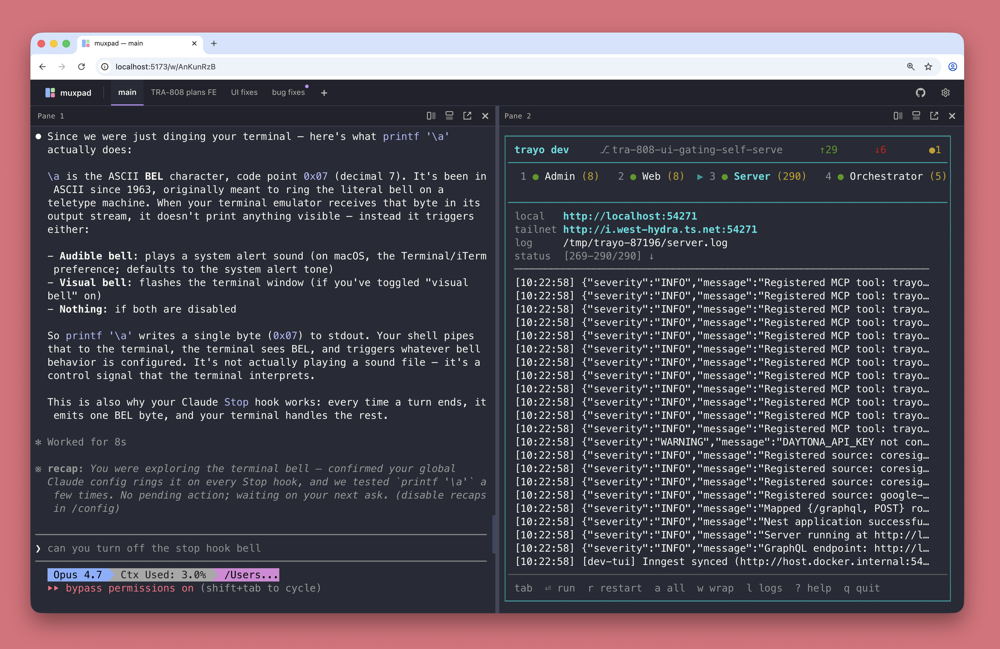

<p align="center">
  
</p>

<h1 align="center">muxpad</h1>

<h3 align="center">A browser-based terminal multiplexer for a box you keep around.</h3>

Each browser tab is a workspace at a stable URL. Inside the workspace, named sub-tabs hold mosaic layouts of shell panes and iframe panes. The PTYs live on the server, not in the browser, so closing the laptop, switching to your phone, and coming back tomorrow shows the same Claude Code session mid-run.

There's no built-in concept of agents, worktrees, projects, or tasks. A pane is a shell or a URL. What runs in it is your problem.

<p align="center">
  
</p>

## Concepts

Three nested containers:

- **Workspace.** Top-level, at `/w/:slug`. One workspace per browser tab is the typical pattern.
- **Tab.** Inside a workspace, a single mosaic layout. The workspace shows a strip of named tabs across the top; clicking one swaps the entire pane layout.
- **Pane.** A leaf of the mosaic. Two kinds: **shell** (a PTY on the host) and **url** (an iframe). Switch a pane between the two in place from the pane chrome.

Multiple browser tabs or devices can attach to the same workspace simultaneously and stay in sync.

## Features

- One PTY per shell pane via `node-pty`. Multiple browser tabs or devices can attach to the same pane and see the same output.
- Tabs and workspaces light up an attention dot when a backgrounded pane rings `\x07` (BEL). Cleared on next visit. Useful for noticing when Claude Code wants you back.
- Pane titles track the foreground program: OSC 0/1/2 title if the program sets one, otherwise the foreground command from the controlling tty.
- Image paste: a screenshot from your clipboard becomes a file on disk and the path gets typed into the PTY, so Claude Code (and similar) read it as an attachment.
- OSC 52 writes from TUIs land on the system clipboard. Cmd/Ctrl+C copies a terminal selection.
- Mobile-aware: page lock, two-finger swipe to scroll inside a pane (one-finger still reaches the TUI's mouse reporting), thumb-grabbable scrollbar, always-visible composer bar above the keyboard with Esc / Tab / ↑ / ↓ / ^C keys.
- Structural state (workspaces, layouts, tab specs, pane specs) lives in SQLite. Shells survive a main-server restart (HMR, pulls) untouched. A `ptyd` restart kills PTYs; they respawn at the last-known cwd, which is polled every 30s.
- Pop a single pane to its own URL at `/p/:paneId` for tearing onto a second monitor or an OBS scene.
- "Open this URL in a real browser tab" surfaces as a click-to-open toast (popup blockers don't eat it) when something inside a pane or the CLI asks for it.
- Five themes and a curated monospace font picker.
- A `muxpad` CLI on the PATH inside every pane, for creating workspaces / tabs / panes from a script.

## Requirements

- macOS or Linux (the cwd-tracking path uses `lsof`)
- Node 22+
- pnpm 10+ (`brew install pnpm` or via corepack)

## Install

For a personal install that runs in the background and survives terminal close:

```bash
pnpm install
pnpm serve            # build if needed, start in background, print URL
pnpm serve:status     # state, URL, log path
pnpm serve:logs       # tail the log
pnpm serve:stop       # SIGTERM the daemon
pnpm serve:restart    # stop + start (after pulling)
```

Logs go to `~/.muxpad/server.log` and `~/.muxpad/ptyd.log`. The daemon does not auto-start on reboot; the macOS launchd setup is in [docs/launchd.md](docs/launchd.md).

First load lands you on the workspace picker at `/`. Make a workspace, you'll land in an empty tab with a single shell pane, split it with the chrome buttons or `muxpad pane new --cmd=…` from inside.

## Security

> **No auth in v1.** Bind to an interface you actually trust, typically your Tailscale IPv4. Don't bind to `0.0.0.0` on an unfiltered network.

| Var | Default | Notes |
|---|---|---|
| `MUXPAD_HOST` | `127.0.0.1` | Bind address. `pnpm serve` picks up `tailscale ip -4` automatically when it's available. |
| `MUXPAD_PORT` | `7777` | TCP port. |
| `MUXPAD_DATA_DIR` | `~/.muxpad` | SQLite DB, attachments, sockets, pid files. |
| `MUXPAD_TAILSCALE_SERVE` | (unset) | Set to `1` to bind to `127.0.0.1` and front the daemon via `tailscale serve` (see below). |

### Optional: nicer URL via Tailscale Serve

To reach muxpad at `https://<your-machine>.<tailnet>.ts.net/` (no port, Tailscale-issued cert):

```bash
pnpm serve:public         # start + map via tailscale serve in one step
pnpm serve:stop           # also tears down the tailscale serve mapping
```

That sets `MUXPAD_TAILSCALE_SERVE=1` so the daemon's only public face is the cert, and runs `tailscale serve --bg https://localhost:7777`. Status / manual control via `tailscale serve status` / `tailscale serve reset`.

## The `muxpad` CLI

`muxpad` is on the PATH inside every shell pane the daemon spawns. Run it from inside a pane and it picks up the current workspace / tab / pane from `MUXPAD_WORKSPACE_ID`, `MUXPAD_TAB_ID`, `MUXPAD_PANE_ID`, so commands without flags do the obvious thing.

```bash
# Split a sibling pane to the right, running `pnpm dev`
muxpad pane new --cmd='pnpm dev'

# Split below this pane and tail a log
muxpad pane new --direction=below --cmd='tail -f app.log'

# Add a Grafana dashboard as an iframe pane to the right
muxpad pane open https://grafana.internal

# Open a real new browser tab (window.open) via click-to-open toast
muxpad open https://github.com/your-org/your-repo
```

Every `new` command prints the created resource on stdout; with `--json` it prints raw JSON for `jq`. See `muxpad --help` for the full surface (daemon control, workspace / tab / pane CRUD, placement flags).

## Architecture

Two processes:

- `muxpad` (main) serves HTTP, the React bundle, structural state (SQLite), and the WebSocket layer. Proxies pane I/O through to ptyd.
- `ptyd` owns terminals. Long-lived. Speaks a small RPC protocol over `~/.muxpad/ptyd.sock`.

The split is load-bearing: editing server code and watching `pnpm dev` HMR-reload it doesn't kill your running shells. Same for `./scripts/muxpad restart` (without `--all`). Restarting `ptyd` kills PTYs.

Repo layout:

```
shared/   zod-validated domain types, WS binary protocol codecs
server/   Hono HTTP, ws, better-sqlite3 (main), and ptyd (node-pty)
web/      React + Vite + TanStack Router + xterm.js + react-mosaic-component
```

## Mobile

muxpad runs on phones, reasonably well. iOS Safari and Chrome on Android. Two-finger swipe inside a pane scrolls the scrollback (one-finger still reaches the TUI's mouse reporting, so Claude Code clicks still work). The composer bar at the bottom is the keyboard entry point: type, tap Send to push the line to the active pane with a trailing CR. The bar grows to a few lines on paste and shrinks back after Send. A row of keys above it sends what iOS keyboards can't produce: Esc, Tab, ↑, ↓, ^C.

Mobile is for checking in on a session you started elsewhere. Long sessions still want a real keyboard.

## Hack on it

```bash
pnpm install
pnpm dev
```

Vite at `:5173` proxies API + WebSocket to the server on `:7777`. The vite config already permits `*.ts.net` hostnames, so `http://your-machine.your-tailnet.ts.net:5173/` works directly during dev.

## Not in scope right now

Open follow-ups: [docs/punch-list.md](docs/punch-list.md). Deliberately out of v1:

- Auth (the Tailscale boundary is the access boundary).
- Moving panes between workspaces.
- A native Claude-block pane type that renders `claude --output-format=stream-json` as HTML instead of as a PTY.
- Right-click context menu.

## License

MIT. See [LICENSE](LICENSE).
